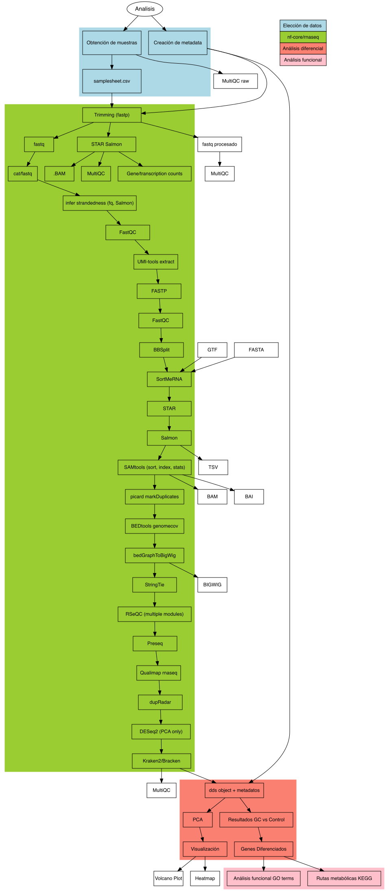

# Expresión Diferencial y Análisis Funcional de Pacientes con Psoriasis en Tratamiento con Glucocorticoides

- Emiliano Ferro Rodriguez
- Jorge Alfredo Suazo Victoria
- Sofia Gamiño Estrada

### Fecha de elaboracion: 01-04-2025

## Material Utilizado

|Descripcion|Informacion|
|-----------|-----------|
|Bioproject|[PRJNA494527](https://www.ebi.ac.uk/ena/browser/view/PRJNA494527)|
|Especie|*Homo Sapiens*|
|Tipo de biblioteca|sinlge-end|
|Metodo|RNA-Total|
|Numero de transcriptomas|34|
|Numero de replicas| 17 Replicas biologicas, con una replica tecnica por cada una ( Control y Firma génica inducida por glucocorticoides en la piel humana)|
|Secuenciador Empleado|Ilumina NextSeq500|
|Profundidad de secuenciacion de cada transcriptoma|12M a 40M|
|Tamaño de las lecturas|75bp|
|Articulo Cientifico|Sarkar MK, Kaplan N, Tsoi LC, Xing X et al. Endogenous Glucocorticoid Deficiency in Psoriasis Promotes Inflammation and Abnormal Differentiation. J Invest Dermatol 2017 Jul;137(7):1474-1483. PMID: 28259685 Los datos se pueden descargar desde NCBI o usando ENA.|


- [nf-core/rna-seq/3.12.0](https://nf-co.re/rnaseq/3.12.0/)
- [nextflow/23.10.0](https://www.nextflow.io/)
- [singularity/3.7.0](https://docs.sylabs.io/guides/3.7/user-guide/)
- [Supercomputo LAVIS (Cluster DNA)](https://lavis.unam.mx/servicios/)
- [Rstudio/Posit](https://posit.co/download/rstudio-desktop/)
### Paquetes de R utilizados

```
library(gprofiler2)
library(enrichplot)
library(clusterProfiler)
library(ggplot2)
library(tidyverse)
library(pheatmap)
library(DESeq2)
library(dplyr)
library(ggExtra)      
library(DOSE)
library(pathview)
library(BiocManager)
library(org.Hs.eg.db) 
library(AnnotationDbi)
library(tree)
```
# Pipeline



## Elección de datos

Para elegir los datos primero se piensa en el organismo con el que se va a tratar en este caso escogimos al *Homo sapiens* (Humano)

Se seleccionó el artículo "[Endogenous Glucocorticoid Deficiency in Psoriasis Promotes Inflammation and Abnormal Differentiation.](https://europepmc.org/article/PMC/5545780)" en el cual se habla del desconocimiento que se tiene de la biologia molecular sobre la terapia con glucocorticoides en pacientes con psoriasis.

Con la información proporcionada por el articulo creamos una tabla que contiene los metadatos para futuros analisis.

## nf-core/rnaseq

Utilizamos el pipeline nf-core/rnaseq basado en Nextflow, una herramienta reconocida por su capacidad de ejecutar flujos de trabajo escalables y reproducibles. Este enfoque es ideal para análisis complejos, ya que reduce la dependencia de configuraciones manuales y facilita la trazabilidad del proceso.

El pipeline requiere tan solo un archivo CSV (samplesheet.csv) que especifica los nombres de las muestras y la ubicación de los archivos FASTQ, simplificando la integración de datos experimentales. Además, se incorpora el genoma de referencia hg38 de Ensembl, lo que proporciona una base robusta para el alineamiento y análisis transcriptómico.

En este pipeline se realizan diversos procesos, segun la pagina [nf-core/rnaseq/3.12.0](https://nf-co.re/rnaseq/3.12.0/) hace lo siguiente: 

- Fusionar archivos FastQ re-secuenciados (cat)

- Sub-muestrear archivos FastQ e inferir automáticamente la polaridad (fq, Salmon)

- Control de calidad de lecturas (FastQC)

- Extracción de UMI (UMI-tools)

- Recorte de adaptadores y calidad (Trim Galore!)

- Eliminación de contaminantes del genoma (BBSplit)

- Eliminación de ARN ribosomal (SortMeRNA)

- Elección de múltiples rutas de alineación y cuantificación:

  - STAR -> Salmon
  
- Ordenar e indexar alineamientos (SAMtools)

- Eliminación de duplicados basada en UMI (UMI-tools)

- Marcado de lecturas duplicadas (picard MarkDuplicates)

- Ensamblaje y cuantificación de transcritos (StringTie)

- Creación de archivos de cobertura bigWig (BEDTools, bedGraphToBigWig)

- Control de calidad extenso:

  - RSeQC

  - Qualimap

  - dupRadar

  - Preseq

  - DESeq2

- Pseudo-alineamiento y cuantificación (Salmon)

- Presentación del control de calidad para lecturas crudas, alineamientos, biotipo de genes, similitud entre muestras y verificación de polaridad (MultiQC, R)

Los outputs que ocupamos mayormente fueron:

- MultiQC procesado
- Archivo .Rdata con Objeto de Expresion Diferencial

Para realizar esto se usó el siguiente script

- Script [nextflow_rna_seq_fastp.sge](https://github.com/3Codon/Proyecto-RNASeq/blob/main/jobs/nextflow_rna_seq_fastp.sge)
  - `-r 3.14.0`: Esta opción la usamos para definir la versión de nf-core rnaseq a usar. En nuestro caso, usamos la versión 3.14.0 porque la versión de nextflow más reciente en el cluster es las 23.10,.0 y la versión de nf-core rnaseq más reciente (3.18.0) ocupa la versión 24.10.0 de nextflow.
  - `-profile singularity`: Usamos esta opción para usar el enviorment de singularity, ya que es mucho más fácil usar esto que cargar todos los programas necesarios en el cluster.
  - `-work-dir`: Esta opción define donde se va a hacer la carepta work.
  - `--input`: En este parametro se tiene que poner la samplesheet. La samplesheet contiene la ruta a todas las muestras, y también otras cosas que se explicaran es su sección dedicada.
  - `--outdir`: Este parametro define la ruta donde se alojaran todos los outputs del pipeline. En este caso, es en nuestra carpeta de **results**.
  - `--max_memory`: Esta opción nos permite limitar el uso de memoria del pipeline. En este caso es importante porque tenemos 34 muestras humanas, lo cual es muy demandante y el cluster tiene un limite de asignación de memoria RAM. Nosotros observamos que este limite era de 120 GB.
  - `--max_cpus`: Esta opción nos permite limitar el uso de cpus. Es un caso igual al anteriori y por lo tanto usamos solo 5 cores.
  - `--fasta`: En este parametro tenemos que poner el directorio donde se encuentra el genoma de referencia humano.
  - `--gtf`: En este parametro se pone la dirección del archivo GTF del genoma de referencia humano elegido.
  - `--trimmer`: En esta opción definimos el trimmer a usar. Podemos elegir entre fastp o trimgalore. En nuestro caso elegimos fastp porque es mucho más rápido y aparte es capaz de autodetectar los adaptadores
  - `--aligner`: Esta opción sirve para definir el alineador a usar. En este caso usamos STAR/salmon
        Por último, definimos los directorios de los caches para no llenar nuestro usuario del cluster.


  
## Expresion Diferencial y Análisis Funcional

Utilizamos el lenguaje de programacion R para realizar los siguientes scripts.

- Script [DEG_analysis.R](https://github.com/3Codon/Proyecto-RNASeq/blob/main/scripts/DEG_Analysis.R)
    1) Importacion de objeto dds.
    2) Modificacion del objeto dds con metadata propia.
    3) Cambiar el diseño del objeto dds.
    4) Correr nuevamente el análisis de expresion diferencial
    5) Normalizacion de datos utilizando la Transformación Estabilizadora de la Varianza.
    6) Análisis de componentes principales para deteccion de batch effect y reconocimiento de patrones.
    7) Obtener los resultados de los contraste de DEG

- Script [Data_Visualization.R](https://github.com/3Codon/Proyecto-RNASeq/blob/main/scripts/Data_Visualization.R)
    1) Visualizacion de genes diferencialmente expresados por volcano plot.
    2) Visualizacion de los genes diferencialmente expresados con mayor relevancia con `pheatmap`.

- Script [GOterms_analysis.R](https://github.com/3Codon/Proyecto-RNASeq/blob/main/scripts/GOterms_analysis.R)
    1) Identificacion de funcion de los genes diferencialmente expresados con mayor relevancia con `gprofiler2`.
    2) Visualizacion de genes expresados en via de señalizacion deseada (IL-17) usando la base de datos KEGG.

# Referencias

- [GOterms en S. cereviacae](https://www.yeastgenome.org/goSlimMapper)
- [Go Term finder](https://go.princeton.edu/cgi-bin/GOTermFinder?)
- [REVIGO - pagina principal](http://revigo.irb.hr/FAQ)
- [REVIGO - Reducir terminos GO, ejemplos](https://www.bioconductor.org/packages/release/bioc/vignettes/rrvgo/inst/doc/rrvgo.html)
- [ggprofiler2](https://cran.r-project.org/web/packages/gprofiler2/vignettes/gprofiler2.html)
- [Pathway enrichment analysis and visualization of omics data](https://cytoscape.org/cytoscape-tutorials/protocols/enrichmentmap-pipeline/#/)
- [Biomedical knowledge mining using GOSemSim and Clusterprofiler](https://yulab-smu.top/biomedical-knowledge-mining-book/clusterprofiler-kegg.html)
- [Pathview - Pagina principal](https://pathview.r-forge.r-project.org/)
- [Pathview - Manual](https://pathview.r-forge.r-project.org/pathview.pdf)
- [KEGG - Pathway ID](https://www.genome.jp/kegg/pathway.html)
- [AnnotationDbi](https://hbctraining.github.io/DGE_workshop_salmon_online/lessons/AnnotationDbi_lesson.html)
- [Gene Ontology enrichment analysis - Uso de varias bases de datos en R](https://davetang.org/muse/2010/11/10/gene-ontology-enrichment-analysis/)
- [nf-core/rna-seq](https://nf-co.re/rnaseq/3.12.0/)
- [Nextflow](https://www.nextflow.io/)
- [Singularity](https://docs.sylabs.io/guides/3.7/user-guide/)
