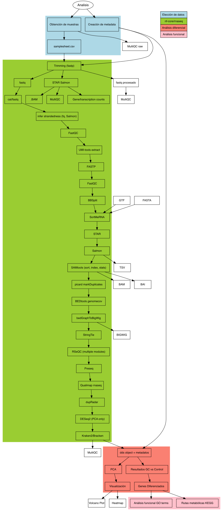
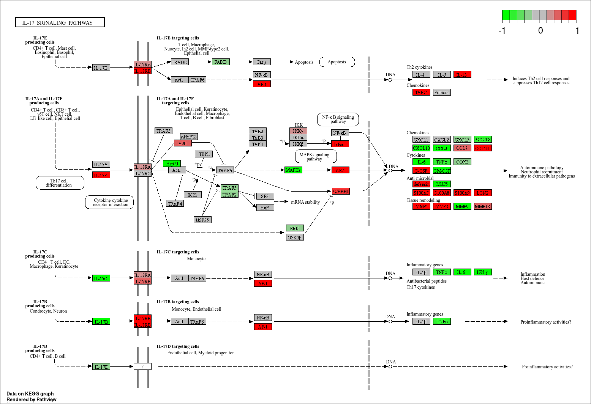

# Descripción de los datos

## Equipo: #1

-   Integrantes:
-   Emiliano Ferro Rodríguez (eferro)
-   Jorge Alfredo Suazo Victoria (jsuazo)
-   Sofia Gamino Estrada (sgamino)

## Correos electrónicos de los integrantes:

-   Ferro: [emiferro\@comunidad.unam.mx](mailto:emiferro@comunidad.unam.mx)
-   Suazo: [jasvpj\@gmail.com](mailto:jasvpj@gmail.com)
-   Sofia: [ghobibohg\@gmail.com](mailto:ghobibohg@gmail.com)

## Descripción de los datos:

-   Bioproject: [PRJNA494527](https://www.ncbi.nlm.nih.gov/geo/query/acc.cgi?acc=GSE120783)

-   Especie: *Homo sapiens*

-   Tipo de bibliotecas: Single-end

-   Método de selección: Total RNA

-   Número de transcriptomas: 34

-   Numero de replicas: 17 Replicas biologicas, con una replica tecnica por cada una ( Control y Firma génica inducida por glucocorticoides en la piel humana)

-   Secuenciador empleado: **Illumina NextSeq 500**

-   Distribución de las muestras: Control: 17 replicas de biopsias de piel de perforación de espesor completo (SRX4792843, SRX479284, SRX4792847, SRX4792849, SRX4792851, SRX4792853, SRX4792855, SRX4792857, SRX4792859, SRX4792861, SRX4792863, SRX4792865, SRX4792867, SRX4792869, SRX4792871, SRX4792873, SRX4792876)

-   Tratamiento: 17 muestras provientes de biopsias de piel tratadas con glucocorticoides (SRX4792844, SRX4792846, SRX4792848, SRX4792850, SRX4792852, SRX4792854, SRX4792856, SRX4792858, SRX4792860, SRX4792862, SRX4792864, SRX4792866, SRX4792868, SRX4792870, SRX4792872, SRX4792874, SRX4792875)

-   Profundidad de secuenciación de cada transcriptoma:

-   Control:

| Muestra    | Profundidad |
|------------|-------------|
| SRX4792843 | 21.3M       |
| SRX479284  | 17.6M       |
| SRX4792847 | 27.3M       |
| SRX4792849 | 25.1M       |
| SRX4792851 | 19M         |
| SRX4792853 | 31.5M       |
| SRX4792855 | 12.6M       |
| SRX4792857 | 12.2M       |
| SRX4792859 | 11.5M       |
| SRX4792861 | 36.2M       |
| SRX4792863 | 26M         |
| SRX4792865 | 24.7M       |
| SRX4792867 | 31.4M       |
| SRX4792869 | 27M         |
| SRX4792871 | 27.2M       |
| SRX4792873 | 28.9M       |
| SRX4792876 | 26.6M       |

-   Tratamiento:

| Muestra    | Profundidad |
|------------|-------------|
| SRX4792844 | 31.7M       |
| SRX4792846 | 29.3M       |
| SRX4792848 | 20.9M       |
| SRX4792850 | 40.7M       |
| SRX4792852 | 29.3M       |
| SRX4792854 | 23.6M       |
| SRX4792856 | 12.5M       |
| SRX4792858 | 13.5M       |
| SRX4792860 | 13.1M       |
| SRX4792862 | 24.6M       |
| SRX4792864 | 27.3M       |
| SRX4792866 | 29.4M       |
| SRX4792868 | 31.3M       |
| SRX4792870 | 24.1M       |
| SRX4792872 | 23.5M       |
| SRX4792874 | 24.6M       |
| SRX4792875 | 23.5M       |

-   Tamaño de las lecturas: 75 pb

-   Artículo científico: Sarkar MK, Kaplan N, Tsoi LC, Xing X et al. Endogenous Glucocorticoid Deficiency in Psoriasis Promotes Inflammation and Abnormal Differentiation. J Invest Dermatol 2017 Jul;137(7):1474-1483. PMID: [28259685](https://pubmed.ncbi.nlm.nih.gov/28259685/) Los datos se pueden descargar desde [NCBI](https://www.ncbi.nlm.nih.gov/geo/query/acc.cgi?acc=GSE120783) o usando [ENA](https://www.ebi.ac.uk/ena/browser/view/PRJNA494527?show=publications).

# Abstract

En este estudio, comparamos la expresión génica en pacientes con psoriasis en tres tipos de muestras de piel: sana, lesional y no lesional. Además, analizamos los cambios en la expresión génica antes y 24 horas después del tratamiento con glucocorticoides para evaluar su impacto a corto plazo.

Para ello, se obtuvieron muestras de piel de 17 pacientes con psoriasis, generando un total de 34 transcriptomas. Se extrajo ARN total de cada muestra y se realizó secuenciación de ARN de alta resolución utilizando la plataforma Illumina NextSeq 500.

El estudio se basó en datos de expresión génica obtenidos mediante secuenciación de ARN (RNA-seq). Estos datos permiten cuantificar los niveles de transcripción de los genes en cada tipo de muestra y evaluar cómo varían en respuesta al tratamiento con glucocorticoides.

Para el análisis de los datos de RNA-seq, utilizamos el pipeline nf-core/rna-seq, implementado en Nextflow, debido a su reproducibilidad, escalabilidad y automatización en el procesamiento de datos de secuenciación. Este pipeline permite realizar pasos clave como control de calidad, alineación de lecturas y cuantificación de expresión génica de manera eficiente y estandarizada.

Posteriormente, realizamos un análisis de expresión diferencial con DESeq2, un paquete de R ampliamente utilizado en estudios transcriptómicos. Esta herramienta aplica modelos estadísticos para identificar genes que presentan cambios significativos en su expresión entre las diferentes condiciones del estudio (antes y después del tratamiento con glucocorticoides).

Para interpretar los cambios en la expresión génica, se realizó un análisis funcional utilizando Gene Ontology (GO), lo que permitió identificar los procesos biológicos más representados entre los genes diferencialmente expresados.

Además, se empleó KEGG para identificar las vías metabólicas en las que están involucrados estos genes. Este análisis permitió contextualizar los efectos del tratamiento con glucocorticoides dentro de rutas biológicas específicas, proporcionando una visión más completa de los mecanismos moleculares implicados en la psoriasis y su respuesta al tratamiento.

Los análisis de expresión diferencial revelaron que el tratamiento con glucocorticoides afecta genes involucrados en procesos antiinflamatorios y de diferenciación celular en la piel de pacientes con psoriasis.

Uno de los genes más regulados por los glucocorticoides fue TSC22D3, el cual desempeña un papel clave en la respuesta inmune y la diferenciación celular, sugiriendo su importancia en la acción del tratamiento.

Otro hallazgo relevante fue la regulación de MERTK, un receptor tirosina quinasa implicado en la resolución de la inflamación crónica, lo que refuerza su posible papel en la modulación de la psoriasis.

# Buenas prácticas de Bioinformática

Nosotros usamos **nf-core rnaseq**, por lo cual la estructura de nuestras carpetas cambiará un poco, pero explicaremos cada una para que no queden dudas.

## Estructura general

```         
├── adapters
│   └── TruSeq3-SE.fa
├── data
│   ├── metadata.tsv
│   └── raw
├── DEG_output
│   └── deseq2_qc
│       ├── deseq2.dds.RData
│       ├── deseq2.pca.vals.txt
│       ├── deseq2.plots.pdf
│       ├── deseq2.sample.dists.txt
│       ├── R_sessionInfo.log
│       └── size_factors
├── quality1
│   ├── multiqc_data
│   ├── multiqc_report.html
│   ├── SRR7959221_fastqc.zip
│   ├── SRR7959222_fastqc.html
│   └── ...
├── quality2
│   ├── aaF1_fastqc.html
│   ├── aaF1_fastqc.zip
│   ├── ...
│   ├── multiqc_data
│   └── multiqc_report.html
├── reference
│   ├── gencode.v47.annotation.gtf.gz
│   └── hg38.fa -> /mnt/Archives/genome/human/GRCh38/UCSC/chromosomes/hg38.fa
├── results
│   ├── Analisis_diferencial
│       ├── dds_TypesnCondition.RData
│       ├── DE_GCvsControl.csv
│       ├── DE_LesionalGC.csv
│       ├── DE_LesionalvsHealthy.csv
│       ├── DE_NonlesionalGC.csv
│       ├── DE_NonLesionalvsHealthy.csv
│       ├── DOWN_GO_GCvsControl.RData
│       ├── figures
│       ├── UP_GO_GCvsControl.RData 
│       └── vst_TypesnCondition.RData
│   ├── fastp
│       ├── aaF1.fastp.html
│       ├── aaF1.fastp.json
│       ├── ...
│       └── log
│           ├── aaF1.fastp.log
│           └── ...
│   ├── fastqc
│       ├── aaF1_fastqc.html
│       ├── aaF1_fastqc.zip
│       ├── ...
│       └── raw
│           ├── aaF1_GC_raw_fastqc.html
│           └── ...
│   ├── multiqc
│       └── star_salmon
│           ├── multiqc_report_data
│           ├── multiqc_report.html
│           └── multiqc_report_plots
│   ├── pipeline_info
│       ├── execution_report_2025-03-25_20-19-09.html`
│       ├── execution_timeline_2025-03-25_20-19-09.html
│       ├── execution_trace_2025-03-25_20-19-09.txt
│       ├── params_2025-03-25_23-40-42.json
│       ├── pipeline_dag_2025-03-25_20-19-09.html
│       ├── samplesheet.valid.csv
│       └── software_versions.yml
│   └── star_salmon
│       ├── aaF1_GC
│           ├── aux_info
│           ├── cmd_info.json
│           ├── libParams
│           ├── logs
│           ├── quant.genes.sf
│           └── quant.sf
│       ├── aaF1_GC.markdup.sorted.bam
│       ├── aaF1_GC.markdup.sorted.bam.bai
│       ├── ...
│       ├── log
│       ├── picard_metrics
│       ├── qualimap
│       ├── rseqc
│       ├── bigwig
│       ├── dupradar
│       ├── featurecounts
│       ├── salmon.merged.gene_counts* #Con esto me refiero a que hay varios archivos de cuentas de salmon.
│       ├── samtools_stats
│       ├── stringtie
│       └── tx2gene.tsv
├── SALMON_index
├── SALMON_output
│   ├── aaF1
│       ├── aux_info
│       ├── cmd_info.json
│       ├── libParams
│       ├── logs
│       ├── quant.genes.sf
│       └── quant.sf
│   ├── ... #Las otras carpetas también son por cada muestra, y son exactamente iguales a la anterior
│   ├── salmon.merged.gene_counts.tsv
│   ├── salmon.merged.*   # Con el * nos referimos a que hay varios archivos que son de las cuentas de salmon.
│   └── tx2gene.tsv
├── scripts
│   ├── cache
│       ├── .nextflow
│       ├── .singularity
│       ├── .singularitynxf
│       ├── .singularitytmp
│       └── .work
│   ├── jobs
│       ├── download_data.sge
│       ├── fastqcs_raw.sge
│       ├── job_quality_raw.sge
│       └── nextflow_rna_seq_fastp.sge
│   ├── out_logs
│       ├── Download_data.o978805
│       ├── Download_data.po978805
│       └── nextflow_test1.o988120
│   ├── r_scripts
│       ├── Analisis.Rproj
│       ├── Data_Visualization.R
│       ├── DEG_Analysis.R
│       ├── GOterms_analysis.R
│       ├── index.html
│       ├── index.Rmd
│       ├── results.zip
│       ├── .Rhistory
│       ├── .Rproj.user
│       └── tables
│   ├── samplesheet.csv
│   └── work
│       ├── 00
│       ├── ...       # El resto son igual, son directorios aislados donde se ejecutan los procesos.
├── STAR_index
├── STAR_output
│   ├── aaF1_GC.markdup.sorted.bam
│   ├── aaF1_GC.markdup.sorted.bam.bai
│   └──  ...  # Los demás archivos son los mismo pero para las demás muestras.
└── TRIM_results
    ├── aaF1_GC.fastp.fastq.gz
    └── ... # Los demás fastqs procesados.
```

### Adapters

En esta carpeta está vacia porque **fastp detecta los adaptadores automaticamente**, por lo cual no había necesidad de descargarlos de internet.

### Data

Aquí tenemos nuestros datos crudos de las muestras, así como los metadastos de estas.

-   `metadata.tsv` : Son los metadatos

-   `raw` : Aqui van los fastqs de las muestras sin procesar.

### DEG_output

Aquí se encuentra la información de los genes diferencialmente expresados. Para hacerlo, nf-core uso **DESeq2**.

-   `deseq2.pca.vals.txt`\`: Son los valores asignados en el PCA a cada muestra.

-   `deseq2.plots.pdf`\`: Aquí encontramos las gráficas creadas por deseq2 en donde se hacen PCAs de las muestras en donde se toman en cuenta los 500 genes más importantes, y con todos los genes. También encontramos un heatmap de las distancias euclideanas entre las muestras según los genes diferencialmente expresados.

-   `deseq2.sample.dists.txt`\`: Aquí estan las distancias euclideanas entre muestras.

-   `deseq2.dds.RData`\`: Este es un objeto de deseq que usamos el el análisis diferencial.

-   `size_factors`\`: Esta es una carpeta donde se encuentran los pesos de cada muestra para que la diferencia en reads no afecte el análisis diferencial. Ref: <https://www.biostars.org/p/359060/>

### quality1

Aquí estan los fastqc de las muestras crudas, sin procesar. Hay un fastqc.html y un fastqc.zip por muestra, y un multiqc que abarca todas las muestras.

-   Lo que **no salió del pipeline de nf-core rnaseq son los datos de multiqc**, esos fueron creados por nosotros aparte.

### quality2

Aquí estan los fastqc de las muestras procesadas con fastp. Hay un fastqc.html y un fastqc.zip por muestra, y un multiqc que abarca todas las muestras. Es importante mencionar que estos fastqc **salieron del pipeline de nf-core rnaseq**, y aparte que nuestras muestras crudas parecian no tener adaptadores.

-   Lo que **no salió del pipeline de nf-core rnaseq son los datos de multiqc**, esos fueron creados por nosotros aparte.

### reference

En esta carpeta cargamos el archivo GTF del genoma humanohg38.fa, de ensembl. También añadimos la ruta al fasta del genoma humano.

### results

Esta es una carepta muy amplia, que contiene todos los outputs del pipeline de nf-core rnaseq. Se explicará cada output bervemente a continuación:

#### Analisis_Diferencial

Esta es la única carpeta que no proviene del pipeline de nf-core, y que fue creada por nosotros para poner los outputs (figuras, csvs) del análisis diferencial que hicimos en R.

#### fastp

Esta carpeta contiene el análisis de fastp de cada muestra, así como sus logs y fastqc.

-   Fastp nos da un html que nos puede ayudar a medir la calidad de nuestros datos, muy parecido a fastqc. Estos estan en el formato muestra.fastp.html y muestra.fastp.json.
-   La otra carpeta es `log` . Esta carpeta contiene toda la información de como fue el procesado de cada muestra (número de reads debajo de un threshold de calidad, reads totales, etc), y tiene la estructura muestra.log.
-   Por último, tenemos una carpeta `fastqc`\`, donde están los fastqcs de las muestras procesadas por fastp. **Estos fastqc son los que pusimos en la carpeta quality2**.

#### fastqc

Esta carpeta es un poco parecida a la de fastp, solo que se centra en los fastqc. Al entrar, tienes los mismos fastqc procesados por fastp que se mencionaron en la viñeta anterior (son los mismos que están en quality2), pero también tenemos la carpeta `raw`\`.

-   En la carpeta `raw`\`tenemos los fastqcs pero de los datos crudos. **Estos son los fastqcs que están en la carpeta quality1**, y tienen la estructura muestra.fastqc.html y muestra.fastqc.zip

#### multiqc

En esta carpeta tenemos un multiqc creado por **nf-core** que resume los datos provenientes de la carepta **star_salmon**.

-   `star_salmon/multiqc_report_data`\`: Aquí están los datos con los que se creó el multiqc. Provienen de los resultados de star_salmon.

-   `star_salmon/multiqc_report.html`\`: Este es el reporte que se puede abrir en tu navegador.

-   `star_salmon/multiqc_report_plots`\`: Estos son los plots que aparecen en el reporte.

#### pipeline_info

Esta carpeta es muy útil, ya que **nos permite saber como es que el pipeline de nf-core rnaseq progresó**. Aquí podemos ver errores, warnings, y también el directorio de `work`\`donde se realizaron los procesos, para cada uno.

-   `execution_report_2025-03-25_20-19-09.html`\`: Este html nos da un reporte general de como fue el pipeline. Si hay errores o el pipe fue exitoso, se puede checar aquí. También se peude checar el uso de memoria por proceso.

-   `execution_timeline_2025-03-25_20-19-09.html`\`: Este es muy similar al anterior, solo que nos da una linea del tiempo.

-   `execution_trace_2025-03-25_20-19-09.txt`\`: Este es un archivo **vital**, ya que nos permite saber **donde (nos da un directorio de la carpeta work) y cuando se realizó cada proceso del pipeline de nf-core, así como su progresión (para saber si hubieron errores)**.

-   `samplesheet.valid.csv`\`: Esta solo es una copia del samplesheet que hicimos (se mencionara más adelante).

#### star_salmon

Esta es la carpeta con más información de todos los resultados de nextflow, ya que aquí podemos encontrar los resultados de la ejecución de los programas **Salmon** y **STAR**. También están aquí los resultados de **DESeq2**, así como muchas otras métricas que nos dan más información del estado de las reads de cada muestra.

-   Vas a observar una carpeta por cada muestra al entrar a esta carepta. Estas carpetas contienen toda la información con respecto al conteo hecho por **Salmon** para cada muestra.
    -   `quant.genes.sf y quant.sf`\`: Contienen el conteo de reads por gen en el caso de quant.genes.sf y de todos los transcritos en caso de quant.sf.

    -   `muestra/log`\`: Esta carpeta contiene los **out_logs** de cada cuantificación hecha por **Salmon**.
-   También en esta carpeta encontraras un archivo **muestra.bai** y **muestra.bam.bai**. Estos son los **alineamientos entre reads in genoma de referencia** hecho por **STAR**. Son los mismos acrhivos que se encuentran en la carpeta **STAR_output**.
-   `/star_salmon/log`\`: En esta carpeta encontraras los outlogs de STAR para el alineamiento de cada muestra. Los archivos **muestra.Log.progress** reflejan como fue progresando el alineamiento, los **muestra.Log.out** contienen el comando que recibió STAR y el alineamiento in vivo, así como sus opciones. Finalmente, el archivo **muestra.Log.final.out** contiene los resultados del alineamiento. En este último puedes ver el porcentaje de reads que alinearon con el genoma, el numero de reads que mapearon a varios sitios del genoma, etc.
-   `star_salmon/picard_metrics`\`: Esta carpeta contiene un análisis con la herramienta **Picard**.Este es un análisis detallado de los alineamientos de reads contra genoma, y nos permite saber las metricas de duplicaciones.
-   `star_salmon/bigwig`\`: Estea es una carpeta con un archivo bigwig por cada alineamiento, utiles para la visualización de los alineamientos.
-   `star_salmon/deseq2_qc`\`:Esta es la carpeta que contiene los resultados de DESeq2, los cuales ya se explicaron anteriormente.
-   `star_salmon/dupradar`\`: En esta carpeta se encuentran varias gráficas (por muestra) que nos permiten conocer la duplicación de reads en nuestro alineamiento usando la herramienta **dupRadar**, **tomando en cuenta que es normal que en RNA-seq existan duplicados, hay genes que se expresan mucho**. Es útil para hacer el multiqc de la calidad de datos de STAR/Salmon.
-   `star_salmon/featurecounts`\`: Esta es una carpeta que usa el paquete **RSubReads**, con una herramienta llamada **featureCounts**. Sirve para hacer conteos de genes o features a partir de un BAM. No es muy útil si ya estamos usando **Salmon**.
-   `star_salmon/qualimap`\`: Esta carpeta contiene una carpeta por cada muestra, el la cual se hace uso de una herramienta llamada **QualiMap**, la cual se encarga de medir la calidad de los BAMs producidos por STAR y también los resultados de **featureCounts**.
-   `star_salmon/rseqc`\`: Es una carpeta que usa una herramienta con resultados muy similares a los de QualiMap. Hace uso de la herramienta RSeQC.
-   `star_salmon/samtools_stats`\`: Es una carpeta que contiene stats, flagstats y idxstats para cada BAM hechas con samtools.
-   `star_salmon/stringtie`\`: Es una carpeta que usa la herramienta **StringTie**, de la universidad Jhon Hopkins, para otra vez cuantificar las reads en cada **BAM.** La diferencia es que StringTie puede reconstruir isoformas no anotadas.
-   Finalmente, en esta carpeta tenemos varios archivos con la estructura **salmon.merged.**\*, los cuales reunen los conteos hechos con **Salmon** en cada muestra, para tenerlos en un solo .tsv. Los archivos más importantes de este tipo son **salmon.merged.gene_counts.tsv** y **salmon.merged.gene_counts_scaled.tsv**, ya que son los que usamos para hacer el análisis de expresión diferencial.

### SALMON_index

Esta carpeta tiene el index formado por salmon.

### SALMON_output

Esta carpeta contiene los **salmon.merged.**\* de la carpeta **star_salmon** (Equipo1/results/star_salmon), así como las carpetas en ese mismo sitio por cada muestra (que ya se mencionó anteriormente que es información proveniente de Salmon).

### scripts

La carpeta de scripts contiene uestros jobs, los out_logs de los jobs, los scripts de R, el directorio del caché del pipeline, la importante carpeta work y el samplesheet.

-   `Equipo1/scripts/jobs`\`: Contienen los jobs que hicimos para nuestro RNA-seq:

    -   `Equipo1/scripts/jobs/download_data.sge`\`: Este job es el que usamos para descargar nuestros datos

        ```{bash, eval = F}
        #!/bin/bash
        # Use current working directory
        #$ -cwd
        #
        # Join stdout and stderr
        #$ -j y
        #
        # Run job through bash shell
        #$ -S /bin/bash
        #
        #You can edit the scriptsince this line
        #
        # Your job name
        #$ -N Download_data
        #
        # Send an email after the job has finished
        #$ -m e
        #$ -M jasvpj@gmail.com
        #
        # If modules are needed, source modules environment (Do not delete the next line):
        . /etc/profile.d/modules.sh
        #
        # Add any modules you might require:
        # Write your commands in the next line
        wget -nc ftp://ftp.sra.ebi.ac.uk/vol1/fastq/SRR795/002/SRR7959202/SRR7959202.fastq.gz
        wget -nc ftp://ftp.sra.ebi.ac.uk/vol1/fastq/SRR795/001/SRR7959221/SRR7959221.fastq.gz
        wget -nc ftp://ftp.sra.ebi.ac.uk/vol1/fastq/SRR795/004/SRR7959194/SRR7959194.fastq.gz
        wget -nc ftp://ftp.sra.ebi.ac.uk/vol1/fastq/SRR795/008/SRR7959218/SRR7959218.fastq.gz
        wget -nc ftp://ftp.sra.ebi.ac.uk/vol1/fastq/SRR795/007/SRR7959197/SRR7959197.fastq.gz
        wget -nc ftp://ftp.sra.ebi.ac.uk/vol1/fastq/SRR795/005/SRR7959215/SRR7959215.fastq.gz
        wget -nc ftp://ftp.sra.ebi.ac.uk/vol1/fastq/SRR795/002/SRR7959212/SRR7959212.fastq.gz
        wget -nc ftp://ftp.sra.ebi.ac.uk/vol1/fastq/SRR795/008/SRR7959208/SRR7959208.fastq.gz
        wget -nc ftp://ftp.sra.ebi.ac.uk/vol1/fastq/SRR795/001/SRR7959191/SRR7959191.fastq.gz
        wget -nc ftp://ftp.sra.ebi.ac.uk/vol1/fastq/SRR795/006/SRR7959206/SRR7959206.fastq.gz
        wget -nc ftp://ftp.sra.ebi.ac.uk/vol1/fastq/SRR795/003/SRR7959193/SRR7959193.fastq.gz
        wget -nc ftp://ftp.sra.ebi.ac.uk/vol1/fastq/SRR795/004/SRR7959214/SRR7959214.fastq.gz
        wget -nc ftp://ftp.sra.ebi.ac.uk/vol1/fastq/SRR795/008/SRR7959198/SRR7959198.fastq.gz
        wget -nc ftp://ftp.sra.ebi.ac.uk/vol1/fastq/SRR795/001/SRR7959201/SRR7959201.fastq.gz
        wget -nc ftp://ftp.sra.ebi.ac.uk/vol1/fastq/SRR795/000/SRR7959220/SRR7959220.fastq.gz
        wget -nc ftp://ftp.sra.ebi.ac.uk/vol1/fastq/SRR795/009/SRR7959209/SRR7959209.fastq.gz
        wget -nc ftp://ftp.sra.ebi.ac.uk/vol1/fastq/SRR795/005/SRR7959205/SRR7959205.fastq.gz
        wget -nc ftp://ftp.sra.ebi.ac.uk/vol1/fastq/SRR795/000/SRR7959190/SRR7959190.fastq.gz
        wget -nc ftp://ftp.sra.ebi.ac.uk/vol1/fastq/SRR795/001/SRR7959211/SRR7959211.fastq.gz
        wget -nc ftp://ftp.sra.ebi.ac.uk/vol1/fastq/SRR795/003/SRR7959213/SRR7959213.fastq.gz
        wget -nc ftp://ftp.sra.ebi.ac.uk/vol1/fastq/SRR795/006/SRR7959216/SRR7959216.fastq.gz
        wget -nc ftp://ftp.sra.ebi.ac.uk/vol1/fastq/SRR795/004/SRR7959204/SRR7959204.fastq.gz
        wget -nc ftp://ftp.sra.ebi.ac.uk/vol1/fastq/SRR795/009/SRR7959189/SRR7959189.fastq.gz
        wget -nc ftp://ftp.sra.ebi.ac.uk/vol1/fastq/SRR795/009/SRR7959219/SRR7959219.fastq.gz
        wget -nc ftp://ftp.sra.ebi.ac.uk/vol1/fastq/SRR795/000/SRR7959210/SRR7959210.fastq.gz
        wget -nc ftp://ftp.sra.ebi.ac.uk/vol1/fastq/SRR795/003/SRR7959203/SRR7959203.fastq.gz
        wget -nc ftp://ftp.sra.ebi.ac.uk/vol1/fastq/SRR795/007/SRR7959217/SRR7959217.fastq.gz
        wget -nc ftp://ftp.sra.ebi.ac.uk/vol1/fastq/SRR795/005/SRR7959195/SRR7959195.fastq.gz
        wget -nc ftp://ftp.sra.ebi.ac.uk/vol1/fastq/SRR795/006/SRR7959196/SRR7959196.fastq.gz
        wget -nc ftp://ftp.sra.ebi.ac.uk/vol1/fastq/SRR795/000/SRR7959200/SRR7959200.fastq.gz
        wget -nc ftp://ftp.sra.ebi.ac.uk/vol1/fastq/SRR795/002/SRR7959222/SRR7959222.fastq.gz
        wget -nc ftp://ftp.sra.ebi.ac.uk/vol1/fastq/SRR795/009/SRR7959199/SRR7959199.fastq.gz
        wget -nc ftp://ftp.sra.ebi.ac.uk/vol1/fastq/SRR795/002/SRR7959192/SRR7959192.fastq.gz
        wget -nc ftp://ftp.sra.ebi.ac.uk/vol1/fastq/SRR795/007/SRR7959207/SRR7959207.fastq.gz
        ```

        -   wget: Es una función que sirve para descargar cosas de la web.

    -   `Equipo1/scripts/jobs/nextflow_rna_seq_fastp.sge`\`: Este es el **job principal**. Es el que usamos para dar las opciones de nextflow y correr el pipeline.

        ```{bash, eval = F}
        #!/bin/bash
        # Use current working directory
        #$ -cwd
        #
        # Join stdout and stderr
        #$ -j y
        #
        # Run job through bash shell
        #$ -S /bin/bash
        #
        #You can edit the scriptsince this line
        #
        # Your job name
        #$ -N nextflow_test1
        #
        # I'm adding sonic speed to my job :) (We need it for this code to run)
        #$ -l vf=120G
        #$ -pe openmp 5
        # Send an email after the job has finished
        #$ -m e
        #$ -M ghobibohg@gmail.com
        #
        # If modules are needed, source modules environment (Do not delete the next line):
        . /etc/profile.d/modules.sh
        #
        # Add any modules you might require:
        module load nextflow/23.10.0
        module load singularity/3.7.0
        #
        # Write your commands in the next line

        export NXF_SINGULARITY_CACHEDIR="/mnt/atgc-d1/bioinfoII/rnaseq/BioProject_2025/Equipo1/script/cache/.singularitynxf"
        export SINGULARITY_CACHEDIR="/mnt/atgc-d1/bioinfoII/rnaseq/BioProject_2025/Equipo1/script/cache/.singularity"
        export NXF_HOME="/mnt/atgc-d1/bioinfoII/rnaseq/BioProject_2025/Equipo1/script/cache/.nextflow"
        export SINGULARITY_TMPDIR="/mnt/atgc-d1/bioinfoII/rnaseq/BioProject_2025/Equipo1/script/cache/.singularitytmp"
        export NXF_WORK="/mnt/atgc-d1/bioinfoII/rnaseq/BioProject_2025/Equipo1/script/cache/otro_cache/.work"

        nextflow run nf-core/rnaseq -r 3.14.0 \
            -profile singularity \
             -work-dir /mnt/atgc-d1/bioinfoII/rnaseq/BioProject_2025/Equipo1/scripts/work \
              --input /mnt/atgc-d1/bioinfoII/rnaseq/BioProject_2025/Equipo1/scripts/samplesheet.csv \
                --outdir /mnt/atgc-d1/bioinfoII/rnaseq/BioProject_2025/Equipo1/results \
                  --max_memory '120.GB' \
                    --max_cpus 5 \
                      --fasta /mnt/Archives/genome/human/GRCh38/ensembl76/chromosomes/Homo_sapiens.GRCh38.dna.primary_assembly.fa \
                          --gtf /mnt/Archives/genome/human/GRCh38/ensembl76/GTF-file/Homo_sapiens.GRCh38.76.gtf \
                            --trimmer fastp \
                              --extra_fastp_args '--cut_front 20' \
                                --aligner star_salmon
        ```

    -   <div>

        -   -r 3.14.0: Esta opción la usamos para definir la versión de nf-core rnaseq a usar. En nuestro caso, usamos la versión 3.14.0 porque la versión de nextflow más reciente en el cluster es las 23.10,.0 y la versión de nf-core rnaseq más reciente (3.18.0) ocupa la versión 24.10.0 de nextflow.

        -   -profile singularity: Usamos esta opción para usar el enviorment de singularity, ya que es mucho más fácil usar esto que cargar todos los programas necesarios en el cluster.

        -   -work-dir: Esta opción define donde se va a hacer la carepta work.

        -   --input: En este parametro se tiene que poner la samplesheet. La samplesheet contiene la ruta a todas las muestras, y también otras cosas que se explicaran es su sección dedicada.

        -   --outdir: Este parametro define la ruta donde se alojaran todos los outputs del pipeline. En este caso, es en nuestra carpeta de **results**.

        -   --max_memory: Esta opción nos permite limitar el uso de memoria del pipeline. En este caso es importante porque tenemos 34 muestras humanas, lo cual es muy demandante y el cluster tiene un limite de asignación de memoria RAM. Nosotros observamos que este limite era de 120 GB.

        -   --max_cpus: Esta opción nos permite limitar el uso de cpus. Es un caso igual al anteriori y por lo tanto usamos solo 5 cores.

        -   --fasta: En este parametro tenemos que poner el directorio donde se encuentra el genoma de referencia humano.

        -   --gtf: En este parametro se pone la dirección del archivo GTF del genoma de referencia humano elegido.

        -   --trimmer: En esta opción definimos el trimmer a usar. Podemos elegir entre fastp o trimgalore. En nuestro caso elegimos fastp porque es mucho más rápido y aparte es capaz de autodetectar los adaptadores

        -   --aligner: Esta opción sirve para definir el alineador a usar. En este caso usamos STAR/salmon

        Por último, definimos los directorios de los caches para no llenar nuestro usuario del cluster.

        </div>

-   `Equipo1/scripts/out_logs`\`: En esta carpeta están los out logs (procesamiento en vivo) de nuestros 2 jobs.

-   `Equipo1/scripts/r_scripts`\`:

-   `Equipo1/scripts/cache`\`: Esta carpeta es importante porque es donde se aloja el caché formado por el pipeline. En caso de no existir, nuestro usuario del cluster se llenaría con el caché del pipeline porque es la ruta predeterminada.

-   `Equipo1/scripts/work`\`: Esta carpeta es como el corazón de todo el pipeline, porque es en esta carpeta donde se hacen los **directorios dedicados a cada proceso**.

-   `Equipo1/scripts/samplesheet.csv`\`: Este archivo es el input del pipeline de nf-core rnaseq. La formamos poniendo el directorio hacia cada muestra cruda, poniendo si es Single end o paired end, el nombre de la muestra y su strandedness.

### STAR_index

En esta carpeta se ubica el index usado en el alineamiento de STAR.

### STAR_output

El output de star es justo los **muestra.bam** y **muestra.bam.bai** que se encuentran en la carpeta **star_salmon** (Equipo1/results/star_salmon)

### TRIM_results

En esta carpeta se encuentran los fastqs procesados por fastp, con la forma **muestra.fastp.fastq.gz**.

#### r_script

Esta carpeta contiene los scripts de R que usamos para hacer el análisis diferencial, la visualización de datos y análisis funcional. También contiene un archivo .Rproj, que es un proyecto de RStudio, y un archivo .Rhistory, que guarda el historial de comandos ejecutados en R.

# Diagrama de flujo 


# Resultados

## Calidad de secuencias

### Secuencias Crudas


### Secuencias Procesadas


## Limpieza de adaptadores

## Alineamiento de secuencia

Los resultados del alineamiento de secuencia fueron los siguientes

```{r echo=FALSE, message=FALSE, warning=FALSE}
table <- read.table("resumen_STAR_metrics.tsv", header = TRUE, sep = "\t")

table <- table[,-c(22:33)]

knitr::kable(table, format = "markdown", caption = "Tabla 3-1: Resumen de alineamiento")
```

En muchos experimentos de RNA‐seq, obtener que aproximadamente el 70% de las secuencias se alinee al transcriptoma o genoma se considera un valor razonable, especialmente en estudios con mamíferos. Esto se debe a que factores como la complejidad del transcriptoma, la presencia de secuencias repetitivas, rRNA residual o incluso RNA degradado pueden reducir la tasa de mapeo en comparación con datos de ADN, donde se esperan tasas más altas.

## Predicción de cuentas

El pipeline de nf-core/rnaseq utiliza **Salmon** para la cuantificación de transcritos. Salmon es un programa de alineación de RNA-seq que se basa en un enfoque de mapeo cuasi-aleatorio (quasi-mapping) y es capaz de realizar la cuantificación de transcritos a partir de datos de RNA-seq de manera rápida y precisa.

Los resultados de Salmon se encuentran en la carpeta `star_salmon` y están organizados por muestra. Cada muestra tiene su propia carpeta que contiene los archivos de salida generados por Salmon, incluyendo los archivos de conteo de genes y transcritos.

```
salmon.merged.gene_counts_length_scaled.rds  salmon.merged.gene_counts_scaled.rds  salmon.merged.transcript_counts.rds
salmon.merged.gene_counts_length_scaled.tsv  salmon.merged.gene_counts_scaled.tsv  salmon.merged.transcript_counts.tsv
salmon.merged.gene_counts.rds                salmon.merged.gene_counts.tsv
```

## Expresión diferencial

Utilizando el .Rdata que el pipeline de nf-core/rnaseq generó, se realizó un análisis de expresión diferencial utilizando el paquete DESeq2. Este análisis permite identificar genes que presentan cambios significativos en su expresión entre las diferentes condiciones del estudio (antes y después del tratamiento con glucocorticoides).

Se utilizo ademas la metadata (Tabla 5-1) para realizar un analisis de expresión diferencial entre las muestras de control y tratamiento con glucocorticoides.

```{r echo=FALSE, message=FALSE, warning=FALSE}
table <- read.table("metadata.tsv", header = TRUE, sep = "\t")
knitr::kable(table, format = "markdown", caption = "Tabla 5-1: Metadata de las muestras de control y tratamiento con glucocorticoides (GC)")
```

Apartir de esto se modifico el objeto dds anteriormente creado con el pipeline de nextflow para que contenga la metadata y que incluya las variables que queremos observar, en este caso el tratamiento y el tipo de muestra. Se utilizo el paquete `DESeq2` para realizar el analisis de expresión diferencial, usando la función `DESeq()` ejecutamos el analisis de expresion diferencial para posteriormente realizar una transformacion de varianza estabilizada (VST), es una técnica que ajusta los datos para hacer que la varianza sea más homogénea entre diferentes niveles de expresión.

Para identificar patrones en los datos, se realizó un análisis de componentes principales (PCA) sobre la matriz normalizada. El PCA es una técnica estadística que reduce la dimensionalidad de los datos y permite visualizar la variabilidad en las muestras. Se utilizaron las variables `Type` (tratamiento) y `Condition` (La condición de la piel) para observar cómo se distribuyen las muestras en el espacio de componentes principales.

![Figura 5-1: La figura muestra un Análisis de Componentes Principales (PCA) basado en datos transformados mediante VST (Variance Stabilizing Transformation), donde los puntos representan muestras clasificadas según la condición de la piel y el tipo de tratamiento. La condición de la piel se indica con colores: rojo para piel saludable, verde para piel con lesión y azul para piel no lesionada, mientras que el tipo de muestra se diferencia por la forma: círculos para controles y triángulos para muestras tratadas con glucocorticoides. Las distribuciones marginales en los ejes permiten observar la variabilidad y agrupamiento de las muestras en los primeros dos componentes principales (PC1 y PC2). En cuanto a la distribución según el tratamiento, se observa que las muestras tratadas con glucocorticoides (triángulos) tienden a agruparse en valores positivos de PC2, mientras que las muestras de control (círculos) están distribuidas en un rango más amplio de PC2, con una mayor presencia en valores negativos. Esto sugiere que el tratamiento con glucocorticoides está asociado con una variabilidad específica capturada en PC2, diferenciándose de las muestras de control en esta dimensión del espacio de componentes principales. Además se observa que las muestras saludables (rojo) tienden a agruparse en valores positivos de PC1, mientras que las muestras lesionadas (verde) y no lesionadas (azul) se concentran en valores negativos de PC1, con una mayor superposición entre estas dos últimas, lo que sugiere que las muestras lesionadas y no lesionadas son más similares entre sí en este espacio de representación que respecto a las muestras saludables.](results/figures/PCA_vsdata.png)

<br>

Los resultados de la funcion `results()` del paquete `DESeq2` nos permiten observar los genes que presentan cambios significativos en su expresión entre las diferentes condiciones del estudio (antes y después del tratamiento con glucocorticoides).

:::: {style="border: 2px solid #9F2142; border-radius: 10px; padding: 10px; margin: 15px;"}
```         
out of 50781 with nonzero total read count
adjusted p-value < 0.1
LFC > 0 (up)       : 661, 1.3%
LFC < 0 (down)     : 667, 1.3%
outliers [1]       : 672, 1.3%
low counts [2]     : 30935, 61%
(mean count < 6)
[1] see 'cooksCutoff' argument of ?results
[2] see 'independentFiltering' argument of ?results
```

::: {style="text-align:center; text-size: 10;"}
Chunk 1: Se identificaron un total de 1.328 genes (661 sobreexpresados + 667 subexpresados) que muestran cambios significativos en respuesta al tratamiento con glucocorticoides. 672 genes fueron atipicos, estos son genes que mostraron patrones de expresión extremos o inconsistentes. El 61% restante corresponde a genes con conteos bajos, lo que indica que no se detectaron suficientes lecturas para realizar un análisis confiable de su expresión.
:::
::::

La cantidad de genes diferencialmente expresados se puede ver de una mejor manera en el volcano plot (Figura 5-2).


<br> Viendo esto podemos hacer un heatmap (Figura 5-3) para identificar cuales son los genes que se encuentran sobreexpresados y subexpresados en las muestras tratadas con glucocorticoides. En los resultados coinciden con la idea de que los glucocorticoides tienen un efecto antiinflamatorio, ya que se observa una disminución en la expresión de genes relacionados con la inflamación y la respuesta inmune. Los que vamos a tomar en cuenta para este reporte son: **GLUL**, **TSC22D3**, **BEST2**, **LAMA2** y **DKK1**.


## Analisis funcional

Para comprobar las funciones de los genes se realizó un análisis funcional utilizando el paquete `gprofiler2`, que permite realizar un análisis de enriquecimiento funcional y obtener información sobre los procesos biológicos, vías metabólicas y funciones moleculares asociadas a los genes diferencialmente expresados.

Los resultados del análisis funcional se presentan en la Figura 6-1, donde se observa que los genes diferencialmente sobreexpresados están relacionados con procesos biológicos.

Se usa `gost()` para realizar el análisis de sobre-representación de términos de Gene Ontology (<GO:BP>, <GO:CC>, <GO:MF>), rutas de KEGG, Reactome (REAC) y bases de datos adicionales como WP, TF, MIRNA, CORUM, HP y HPA.

Se almacenan los términos enriquecidos para genes up- y down-regulated.

Gráfico Manhattan (Figura 6-1c): Se genera una imagen de dispersión (Manhattan plot) con los términos enriquecidos y su significancia (p-value).

Barplot de genes Down-regulated(Figura 6-1d): Se grafican los 40 términos más enriquecidos para genes subexpresados.

Barplot de genes Up-regulated(Figura 6-1a): Se grafican los 40 términos más enriquecidos para genes sobreexpresados.


\`

Ademas se realizo una visualizacion de la via de señalizacion de IL-17 que se caracteriza principalmente por la activacion de la via de NF-kB y MAPK, lo que lleva a la produccion de citoquinas proinflamatorias como IL-6, IL-8 y TNF-alfa. Esta via es importante en la patogenesis de la psoriasis, ya que se ha demostrado que los glucocorticoides pueden inhibir la activacion de esta via y reducir la inflamacion en la piel.

Utilizando el paquete `pathview`, se generó una visualización de la vía de señalización de IL-17 (Figura 6-2). Esta vía es relevante en la psoriasis, ya que se ha demostrado que los glucocorticoides pueden inhibir su activación y reducir la inflamación en la piel.



# Discusión

El objetivo del artículo "Endogenous Glucocorticoid Deficiency in Psoriasis Promotes Inflammation and Abnormal Differentiation" es entender, a nivel de la biología molecular, el efecto de la baja producción endógena de glucocorticoides en la psoriasis.
Los autores demuestran que la deficiencia de glucocorticoides induce una respuesta proinflamatoria por parte de los queratinocitos, y que la biosíntesis de glucocorticoides es suprimida por las citoquinas proinflamatorias. También prueban que un tratamiento con glucocorticoides tópicos podría restablecer estas vías de producción endógena de glucocorticoides y normalizar la diferenciación epidérmica.
Se enfocaron en estudiar los genes relacionados con los glucocorticoides, especialmente NR3C1.

Por otra parte, nuestro objetivo es encontrar genes diferencialmente expresados en la psoriasis y su relación con los glucocorticoides. Para esto, realizamos un análisis de expresión diferencial entre muestras de piel con psoriasis, antes y después del tratamiento con glucocorticoides. Encontramos que los genes están relacionados con la respuesta inmune, la inflamación, la proliferación y la biosíntesis de aminoácidos, entre otros procesos, lo que sugiere que los glucocorticoides pueden tener un efecto antiinflamatorio en la psoriasis.

Uno de los hallazgos más relevantes que encontramos en nuestro análisis de expresión diferencial (Figura 5-3) fue la sobreexpresión de GLUL en las muestras tratadas con glucocorticoides. Este gen codifica para la enzima glutamina sintetasa, que es responsable de la síntesis de glutamina a partir de glutamato y amoníaco. El glutamato activa los receptores de glutamato en las células inmunitarias (especialmente en las células $T\gamma\delta$). La activación de estos receptores afecta la supervivencia de dichas células y modula los niveles de citoquinas proinflamatorias como la IL-17A, la cual induce inflamación mediante el reclutamiento de neutrófilos, aumentando la respuesta autoinmune, así como la liberación de quimiocinas y péptidos antimicrobianos, como se puede observar en la Figura 6-2.
Por lo tanto, la sobreexpresión de GLUL en las muestras tratadas con glucocorticoides podría estar relacionada con la disminución de la inflamación ya que transforma el glutamato en glutamina, impidiendo la produccion de IL-17A.

Otro hallazgo importante fue la sobreexpresión de TSC22D3 (conocida tambien como GLIZ), un gen que codifica para una proteína que actúa como un represor transcripcional de la IL-17 limitando la diferenciacion celular proinflamatoria y esta proteina interactua con otras citoquinas proinflamatorias. GLIZ interfiere con interacciones proteina-proteina con los factores de transcripción NF-kB y AP-1 impidiendo las translocasion nuclear. Ademas GLIZ se una a RAS/RAF y suprimir la via MAPK. Dado que GLIZ al expresarse tiene un papel antiinflamatorio. En nuestros resultados, obtuvimos una sobreexpresion de GLIZ o TSC22D3 sugiriendo que su sobreexpresión podría contribuir a la disminución de la inflamación en las muestras tratadas con glucocorticoides.

El ultimo hallazgo que obtuvimos fue en relacion al gen DKK-1 o tambien conocida como Dickkopf-1 que codifica para una proteína que actúa inhibidor de la vía Wnt/β-catenina,las cascadas de senalizacion de esta via son cruciales en muchos procesos biologicos como migracion celular, diferenciacion, proliferacion celular; en este caso nos enfocaremos en este ultimo proceso biologico. En  tejidos sanos DKK-1 normalmente tiene una expresion moderada, en nuestros resultados podemos observar en las muestras tratadas con glucocorticoides DDK-1 tiene una expresion moderada, esto sugiere a que el tejido esta mejorando,  diferencia de las muestras sin tratamiento se observa a DDK-1 infraexpresado, lo cual es congruente ya que a menor expresion de este gen, aumenta la proliferacion celular por medio de la via Wnt/β-catenina.


# Citas y referencias

Loukia N. Lili, Anna Klopot, Benjamin Readhead, Gleb Baida, Joel T. Dudley, Irina Budunova,
Transcriptomic Network Interactions in Human Skin Treated with Topical Glucocorticoid Clobetasol Propionate,
Journal of Investigative Dermatology,
Volume 139, Issue 11,
2019,
Pages 2281-2291,
ISSN 0022-202X,
https://doi.org/10.1016/j.jid.2019.04.021.
(https://www.sciencedirect.com/science/article/pii/S0022202X1931629X)
Abstract: Glucocorticoids are the most frequently used anti-inflammatory drugs in dermatology. However, the molecular signature of glucocorticoids and their receptor in human skin is largely unknown. Our validated bioinformatics analysis of human skin transcriptome induced by topical glucocorticoid clobetasol propionate (CBP) in healthy volunteers identified numerous unreported glucocorticoid-responsive genes, including over a thousand noncoding RNAs. We observed sexual and racial dimorphism in the CBP response including a shift toward IFN-α/IFN-γ and IL-6/Jak/Signal transducer and activator of transcription (STAT) 3 signaling in female skin; and a larger response to CBP in African-American skin. Weighted gene coexpression network analysis unveiled a dense skin network of 41 transcription factors including circadian Kruppel-like factor 9 (KLF9), and ∼260 of their target genes enriched for functional pathways representative of the entire CBP transcriptome. Using keratinocytes with Kruppel-like factor 9 knockdown, we revealed a feedforward loop in glucocorticoid receptor signaling, previously unreported. Interestingly, many of the CBP-regulated transcription factors were involved in the control of development, metabolism, circadian clock; and 80% of them were associated with skin aging showing similarities between glucocorticoid-treated and aged skin. Overall, these findings indicate that glucocorticoid receptor acts as an important regulator of gene expression in skin—both at the transcriptional and posttranscriptional level—via multiple mechanisms including regulation of noncoding RNAs and multiple core transcription factors.


Guanhua Li, Lu Liu, Zhihua Yin, Zhizhong Ye, Nan Shen,
Glutamine metabolism is essential for the production of IL-17A in γδ T cells and skin inflammation,
Tissue and Cell,
Volume 71,
2021,
101569,
ISSN 0040-8166,
https://doi.org/10.1016/j.tice.2021.101569.
(https://www.sciencedirect.com/science/article/pii/S0040816621000859)
Abstract: γδ T cell is one of the most important pathogenic immune cells in autoimmunity, especially in mucosal and epithelial diseases. Metabolism is essential for the maintenance of immune homeostasis. However, unlike αβ T cells, the metabolic regulation of γδ T cell activation still remain unclear. Here, we identified glutamine metabolism as a critical regulator for the generation of IL-17-producing γδ T cells. Metabolic screening uncovered that amino acids related to glutamine metabolism increased most obviously during γδ T cell activation. Pharmaceutical blocking of glutamine impaired IL-17 production in γδ T cells both in vitro and in vivo. Mechanism studies further revealed that genes downregulated upon glutamine deprivation enriched in IL-17 and IL-23/STAT3 signaling pathways. Consistent with this, the activation of STAT3 was suppressed after glutamine blocking. More importantly, application of glutamine antagonist in vivo alleviated the progression of IL-23 induced psoriatic mice model. In addition, both the glutamine level and the expression of glutamine related enzymes were found higher in psoriasis patients when compared with healthy controls. Therefore, our work identified an important metabolic regulatory pathway in γδ T cell activation and suggested that glutamine metabolism could be used as a target for the treatment of γδ T cell related diseases.
Keywords: Autoimmune disease; γδ T cell; Glutamine metabolism


